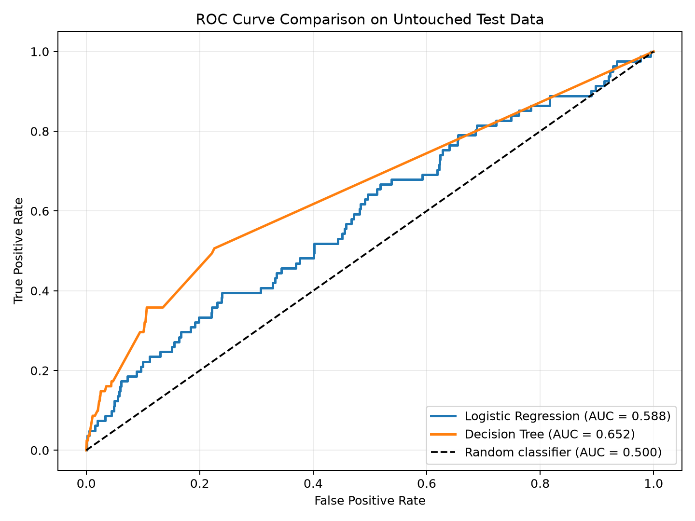
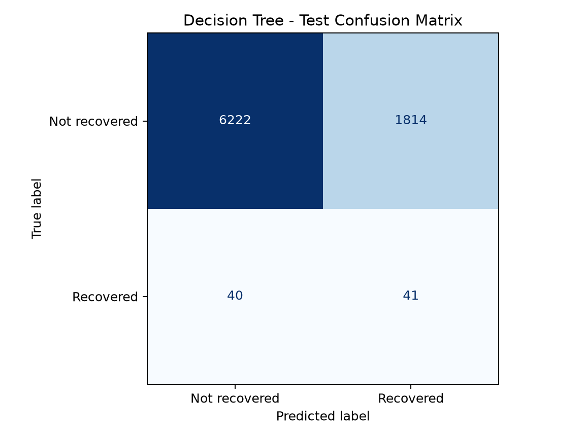

# Model Building, Evaluation, and Deployment Results

## Predictive model building

The project target was converted to a binary value: `RECOVERED` was encoded as 1, while `STOLEN` and `UNKNOWN` were encoded as 0 (`NOT RECOVERED`). The dataset contained 40,583 records, including only 403 recovered bicycles (0.99%). A stratified 80/20 split preserved this ratio and produced 32,466 training records and 8,117 untouched test records.

The same scikit-learn preprocessing structure was used for both models. Missing numerical data was replaced with the median and standardized. Missing categorical data was replaced with the most frequent value and one-hot encoded. Unknown categories are ignored by the encoder so that the API can accept new values. Rare categories occurring fewer than five times are grouped. Both classifiers used balanced class weights to reduce the effect of the severe class imbalance.

The required algorithms were:

1. Logistic regression using `class_weight="balanced"`, the `liblinear` solver, and a maximum of 3,000 iterations.
2. Decision tree using `class_weight="balanced"`, maximum depth 12, minimum leaf size 20, and random state 42.

`PRIMARY_OFFENCE` was intentionally excluded. Recovered cases can use values such as `PROPERTY - FOUND`, which directly reveal the target and would create data leakage. The model therefore uses information that could reasonably be available when a theft is reported.

## Model scoring and evaluation

Both models were evaluated against the same test records that were never used during training.

| Model | Accuracy | Balanced accuracy | Precision | Recall | F1 | ROC-AUC |
|---|---:|---:|---:|---:|---:|---:|
| Logistic regression | 76.78% | 56.50% | 1.56% | 35.80% | 2.99% | 0.5883 |
| **Decision tree** | **77.16%** | **64.02%** | **2.21%** | **50.62%** | **4.24%** | **0.6524** |

The logistic regression confusion matrix was:

| Actual / Predicted | Not recovered | Recovered |
|---|---:|---:|
| Not recovered | 6,203 | 1,833 |
| Recovered | 52 | 29 |

The decision tree confusion matrix was:

| Actual / Predicted | Not recovered | Recovered |
|---|---:|---:|
| Not recovered | 6,222 | 1,814 |
| Recovered | 40 | 41 |

The decision tree is recommended because it achieved the best ROC-AUC, balanced accuracy, recall, F1 score, and ordinary accuracy. It identified 41 of the 81 recovered bicycles in the test set, compared with 29 for logistic regression.

Ordinary accuracy must be interpreted carefully. Since more than 99% of records are not recovered, a classifier that always predicts `NOT RECOVERED` would exceed 99% accuracy but provide no useful recovery detection. ROC-AUC, balanced accuracy, recall, precision, and the confusion matrices therefore provide a more honest comparison. The chosen model's ROC-AUC of 0.6524 shows modest predictive ability, not a highly accurate guarantee. Its 2.21% precision also shows that many positive predictions are false positives because recovered cases are extremely rare.

## Model deployment

The complete winning pipeline, including missing-value handling, categorical encoding, scaling, and the decision tree, was serialized to `artifacts/bicycle_recovery_model.pkl` with Python's pickle module. The Flask application deserializes this artifact when it starts. Keeping the preprocessing and classifier in one serialized pipeline prevents training/inference mismatches.

The Flask service provides:

- `GET /health` to confirm that the model loaded successfully;
- `GET /api/schema` to describe the 16 required inputs and return an example;
- `POST /predict` to accept one JSON record and return the predicted class, recovery probability, non-recovery probability, model name, and decision threshold;
- `GET/POST /` to provide a basic Jinja HTML prediction form.

The Python client in `test_api_client.py` sends examples drawn only from the untouched test split. The Postman collection in `postman/Bicycle_Theft_Model_API.postman_collection.json` performs the health check and sends a held-out test record to the prediction API. `smoke_test.py` separately verifies pickle deserialization, successful predictions, and error handling without requiring a separately running server.

## Assumptions and constraints

- `UNKNOWN` is treated as not recovered because the dataset does not confirm a returned bicycle for these records.
- Geographic coordinates are approximate because Toronto Police offset locations to protect privacy.
- The historical dataset may not represent future reporting, policing, or recovery patterns.
- Rare recovery outcomes limit precision and model certainty.
- The service is an educational risk estimate and should not be used as a guarantee or as the only basis for police resource decisions.
- Pickle files must only be loaded from a trusted source because untrusted pickle data can execute code during deserialization.
